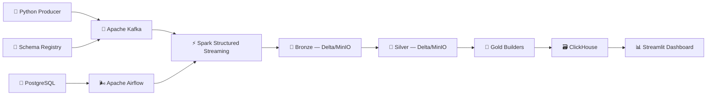

# Real-Time Stock Market Data Pipeline

A production-grade streaming analytics platform that ingests simulated market events, processes them through a multi-layer lakehouse, and serves real-time insights through a premium analytics dashboard.

## Architecture



## Technology Stack

| Layer | Technology |
|---|---|
| Event Production | Python, Avro, Confluent Schema Registry |
| Message Streaming | Apache Kafka 7.5 |
| Stream Processing | Apache Spark 3.x Structured Streaming |
| Lakehouse Storage | Delta Lake, MinIO (S3-compatible) |
| Analytical Serving | ClickHouse |
| Orchestration | Apache Airflow |
| Metadata Store | PostgreSQL 15 |
| Dashboard | Streamlit 1.46, Plotly 6.2, psutil, Docker SDK |
| Deployment | Docker Compose |

## Folder Structure

```text
.
├── airflow/                  # Airflow image, DAGs, logs, plugins
├── clickhouse/init/          # ClickHouse gold schema SQL
├── dashboard/                # Streamlit app — views, components, metrics modules
│   ├── components/           # cards, charts, sidebar, header, status_bar, footer
│   ├── views/                # 14 page views (including Incident & Recovery)
│   └── assets/style.css      # Premium dark UI (Inter, glassmorphism, animations)
├── gold/                     # Gold aggregation utilities
├── producer/                 # Avro market event producer
├── scripts/                  # Pipeline startup scripts
├── spark/                    # Bronze, silver, gold, replay, optimize jobs
├── tools/                    # Support tooling
├── docker-compose.yml        # Full local production stack
└── README.md
```

## Dashboard

Available at **<http://localhost:8501>** after starting the stack.

Auto-refreshes every **15 seconds** using `streamlit-autorefresh`. All data is sourced live from the running services — no hardcoded or randomly generated metrics.

### Pages

| Page | Data Source | Key Features |
|------|------------|--------------|
| 📈 Market Overview | ClickHouse `gold_market_kpis` | 7 KPI cards, buy/sell donut, volume bar, leaderboard, activity feed |
| 🏆 Top Symbols | ClickHouse `gold_top_symbols` | Search/filter, treemap, VWAP chart, ranked table |
| 🔍 Symbol Analysis | ClickHouse `gold_symbol_summary` + `gold_ohlc` | Symbol picker, candlestick+volume chart, 7 per-symbol KPIs |
| 🕯 OHLC | ClickHouse `gold_ohlc` | Multi-symbol candlestick grid (1 or 2 column), OHLC summary table |
| ⚙ Pipeline Health | `health.py` + ClickHouse + psutil | Full-width health banner, 3 Plotly gauges, service grid, gold freshness, alerts |
| 🛡 Failure Recovery | ClickHouse + `health.py` | Recovery KPIs, pipeline stage flow, Bronze/Silver/Gold layer status, event feed |
| ⚡ Spark Cluster | Spark `GET /json` API | Cluster cards, core/memory gauges, worker table, active apps |
| 🌬 Airflow Monitor | Airflow REST API | Health cards, DAG list, per-DAG run history |
| 📨 Kafka Cluster | `KafkaAdminClient` | Broker status, topic table, Schema Registry subjects |
| 💾 Storage Monitor | ClickHouse + MinIO SDK + psycopg2 | 3-store health badges, per-store metrics, MinIO bucket chart |
| 📊 Performance Benchmark | ClickHouse + psutil + Spark | Real benchmark score, radar chart, stage throughput, latency breakdown |
| 🏗 Architecture | `health.py` + static | Horizontal pipeline flow, stack inventory with live status, service links |
| 📜 Live Logs | `docker logs` subprocess | Service selector, level filter, color-coded log table |
| 🚨 Incident & Recovery Center | Docker SDK + `health.py` | Chaos testing injection, automated background service recovery, incident timeline |

### Live Data Sources

| Service | Method |
|---------|--------|
| ClickHouse | `clickhouse_connect` → 4 gold tables, cached TTL 10s |
| Apache Spark | `GET http://spark-master:8080/json` |
| Apache Kafka | `KafkaAdminClient(kafka:29092)` |
| Apache Airflow | `GET http://airflow-webserver:8080/api/v1/` |
| MinIO | `minio.Minio` SDK |
| PostgreSQL | `psycopg2(admin/admin/stockdb)` |
| Host System | `psutil` CPU, memory, disk |
| Schema Registry | `GET http://schema-registry:8081/subjects` |
| Container Logs | `docker logs --tail N <container>` |
| Chaos & Recovery | `docker.from_env()` via mounted socket |

## Setup

### Prerequisites

- Docker Desktop (with at least 8 GB RAM allocated)

### Start the Stack

```bash
git clone <repo-url>
cd stock-pipeline
docker compose up --build
```

### Access the Services

| Service | URL |
|---------|-----|
| 📊 Dashboard | <http://localhost:8501> |
| ⚡ Spark Master | <http://localhost:8080> |
| 🌬 Airflow | <http://localhost:8088> |
| 🗄 MinIO Console | <http://localhost:9001> |
| 📜 Schema Registry | <http://localhost:8081> |
| 🗃 ClickHouse HTTP | <http://localhost:8123> |

### Default Credentials

| Service | Username | Password |
|---------|----------|----------|
| Airflow | `admin` | `admin` |
| MinIO | `admin` | `admin123` |
| ClickHouse | `admin` | `admin123` |
| PostgreSQL | `admin` | `admin` / DB: `stockdb` |

## Docker Commands

```bash
# Build and start all services
docker compose up --build

# Start detached
docker compose up -d

# Follow all logs
docker compose logs -f

# Follow dashboard only
docker compose logs -f dashboard

# Rebuild dashboard only (fast — uses cached pip layer)
docker compose build dashboard
docker compose up dashboard --no-deps

# Stop
docker compose down

# Stop and remove volumes (full reset)
docker compose down -v
```

## Data Pipeline Flow

```
Producer → Kafka → [Bronze Stream] → MinIO/Delta
                                         ↓
                              [Silver Stream] → MinIO/Delta
                                         ↓
                              [Gold Builders] → ClickHouse
                                         ↓
                              Streamlit Dashboard (30s refresh)
```

1. **Producer** emits Avro-encoded market events to Kafka topics (one per symbol).
2. **Bronze Stream** (Spark) consumes Kafka, writes raw events to MinIO Delta.
3. **Silver Stream** (Spark) validates, deduplicates, and enriches Bronze data.
4. **Gold Builders** aggregate market KPIs, symbol summaries, top symbols, and OHLC windows, writing to ClickHouse.
5. **Dashboard** queries ClickHouse gold tables and all service APIs for live monitoring.
6. **Airflow** orchestrates operational jobs; **PostgreSQL** stores Airflow metadata.

## ClickHouse Gold Schema

| Table | Description |
|-------|-------------|
| `gold_market_kpis` | Aggregate market volume, VWAP, latency, buy/sell split |
| `gold_symbol_summary` | Per-symbol price, volume, VWAP, spread, latency |
| `gold_top_symbols` | Volume-ranked symbol leaderboard |
| `gold_ohlc` | OHLC candlestick windows per symbol |

## Future Improvements

- Persist benchmark history for true time-series performance trends
- Add Kafka consumer lag tracking via JMX or Burrow
- Add Delta table size and checkpoint freshness to pipeline health
- Add Prometheus + Grafana for long-term infrastructure observability
- Add CI for import validation, Docker Compose linting, and Spark job checks
- Add real-time WebSocket push to avoid polling overhead
